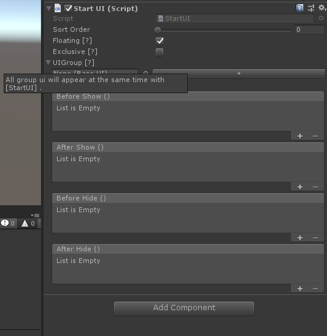
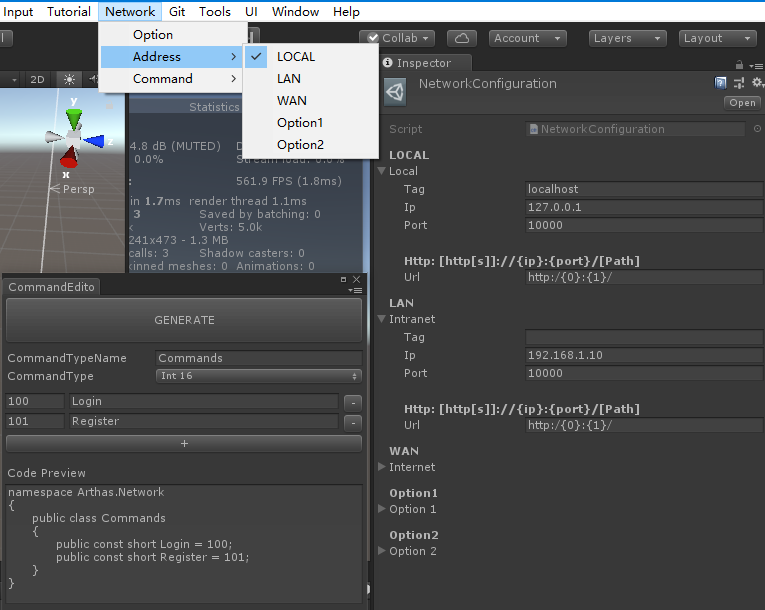
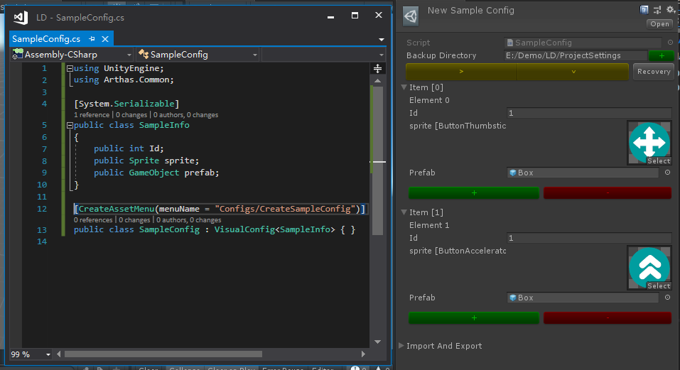

# UnityWorkbox 

[简体中文](./README-ZH-cn.md)

Unity3d developer workbox that has some useful Unity3d script extensions and editor tools

## UI Management

* UIManager
* PanelUI
* Group/Exclusive/Floating

## Network

* Netwoker

* Connector
  * IConnector
  * TCPConnector

* MessageHandler
  * INetworkMessage & DefaultMessage
  * INetworkMessageHandler & DefaultMessageHandler

* NetworkConfiguration
  * Option
  * Switch
  * Command

## Tools

* Git
* VisualConfig
* ConsoleLogger
* JsonList & JsonDict
